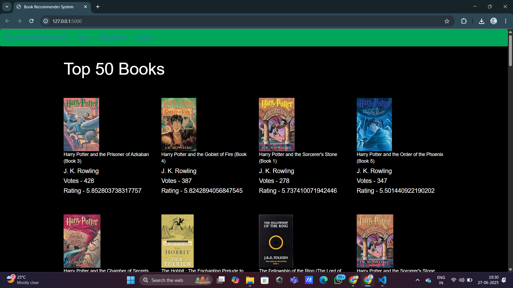
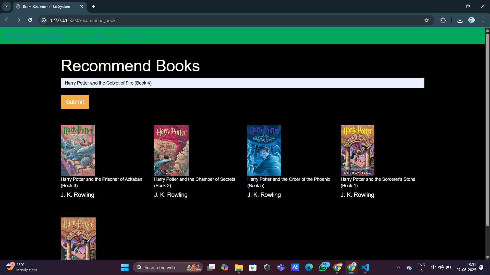

# 📚 Book Recommender System

An interactive Flask-based web application that recommends books based on a selected title. It uses collaborative filtering via precomputed similarity scores to suggest books similar to the one a user selects. The homepage also features a list of popular, highly-rated books.

## 🔧 Features

- 📖 Displays popular books with high ratings and vote counts.
- 🔍 Allows users to input a book title and receive top 5 similar recommendations.
- 🧠 Uses precomputed similarity scores with collaborative filtering.
- 🖼️ Presents book title, author, and cover image in results.

## 🛠️ Tech Stack

- **Backend:** Python, Flask
- **Frontend:** HTML, Jinja2 (templates)
- **Libraries:** NumPy, Pickle
- **Data Handling:** Pandas

## 🗂️ Project Structure

book-recommender/
├── app.py # Main Flask app (entry point)
├── main.py # (Optional duplicate or legacy script)
├── templates/ # Contains HTML templates (index2.html, recommender.html)
├── books.pkl # Book metadata (title, author, image)
├── popular.pkl # DataFrame of top-rated books
├── pt.pkl # User-book pivot table
├── similarity_score.pkl # Cosine similarity matrix for recommendations


## 🚀 Running the App Locally

1. **Clone the repository:**

   ```bash
   git clone https://github.com/adrijaa291/book-recommender.git
   cd book-recommender
2. **Install Dependencies:**

   ```bash
   pip install flask numpy
3. **Run the app:**

   ```bash
   python app.py
4. **Open your browser and visit:**

   ```bash
   http://127.0.0.1:5000/

📘 About the Model
A user-book rating matrix was constructed to understand relationships between users and books.

Using this matrix, cosine similarity was calculated to measure similarity between books.

The similarity scores are precomputed and stored in similarity_score.pkl for fast lookups during recommendations.

Data was cleaned and processed offline before saving as .pkl files.

## 📸 Screenshots

### 🔹 Homepage


### 🔹 Book Recommendations


